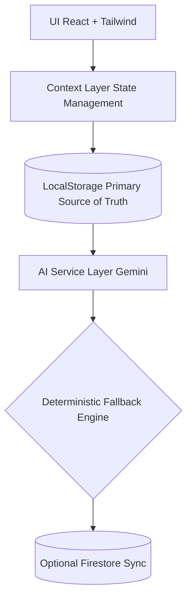

<div align="center">


### AI-Powered Business Operating System for Bharat’s Local Stores

**Local-first. AI-native. Cloud-optional.**

<br/>

[](https://reactjs.org/)
[](https://www.typescriptlang.org/)
[](https://tailwindcss.com/)
[](https://ai.google.dev/)
[](https://firebase.google.com/)

</div>

---

##  Problem

India has over **6+ crore small businesses**, yet most operate:

-  Without structured digital inventory
-  Without analytics
-  Without automation
-  With heavy manual data entry

Existing POS tools are:

- Complex
- English-heavy
- Not built for Bharat
- Not AI-native

---

##  Solution — Dukaan.AI

Dukaan.AI is a **local-first AI business operating system** that transforms small offline stores into intelligent, data-driven businesses.

It removes friction by applying AI directly at the point of interaction — not as a separate analytics layer.

---

##  Core Capabilities

### 1️⃣ AI-Powered Onboarding 

Instead of rigid forms, onboarding dynamically adapts using **Gemini 2.5 Flash**, generating structured business intelligence in real time.

- Business-type aware questions
- Context-based prompts
- Structured JSON output
- Fallback-safe architecture

---

### 2️⃣ Multi-Modal Data Ingestion 

Manual entry is optional.

Merchants can:

- 📸 **Scan bills** via Gemini Vision
- 💬 **Paste WhatsApp** order text
- 📊 **Upload CSV** bulk data

All unstructured input is normalized into clean JSON objects via AI + deterministic fallback logic.

No backend required.

---

### 3️⃣ Inventory-Aware AI Insights 

The system continuously analyzes:

- Inventory stock
- Sales patterns
- Product velocity

Gemini generates contextual, multilingual business advice in real time.

If AI fails → deterministic logic keeps app functional.

---

### 4️⃣ Local-First Architecture 

Dukaan.AI works **100% offline** via `localStorage`.

Why?

- No dependency on hackathon WiFi
- Instant performance
- Zero onboarding friction

Cloud sync via **Firebase Firestore** is additive and optional.

If cloud fails → local state remains intact.

---

### 5️⃣ Hybrid Cloud Sync 

- Firestore integration (non-blocking)
- Optional authentication
- Future-ready multi-device architecture
- Zero impact on demo stability

---

##  Architecture Overview



Key design principle:

> **No AI call can block or crash core business functionality.**

---

##  AI Integration Points

Gemini 2.5 Flash powers:

-  Onboarding question generation
-  Receipt OCR (Vision API)
-  WhatsApp parsing
-  CSV normalization
-  Inventory insights

All calls:

- Enforced JSON structure
- Wrapped in try/catch
- Timeout controlled
- Fail-safe fallback implemented

---

##  Tech Stack

| Domain               | Technology                                                 |
| -------------------- | ---------------------------------------------------------- |
| **Frontend**         | React 19, Vite, Strict TypeScript, Tailwind CSS            |
| **State Management** | React Context API                                          |
| **Persistence**      | LocalStorage (Primary), Firebase Firestore (Additive Sync) |
| **AI Engine**        | `@google/genai`, Gemini 2.5 Flash                          |
| **Deployment**       | GitHub Pages                                               |

---

##  Security & Tradeoffs

For hackathon velocity:

- API keys are client-exposed
- No auth requirement for demo

Production roadmap:

- Move AI calls to serverless functions
- Secure keys server-side
- Enforce authentication
- Introduce schema validation

---

##  Run Locally

```bash
git clone https://github.com/dishudhalwal12/dukaan-ai.git
cd dukaan-ai/in
npm install

# Add your environment variables:
# VITE_GEMINI_API_KEY
# VITE_FIREBASE_API_KEY
# VITE_FIREBASE_PROJECT_ID
# etc.

npm run dev
```

<br>
<div align="center">
  
</div>
