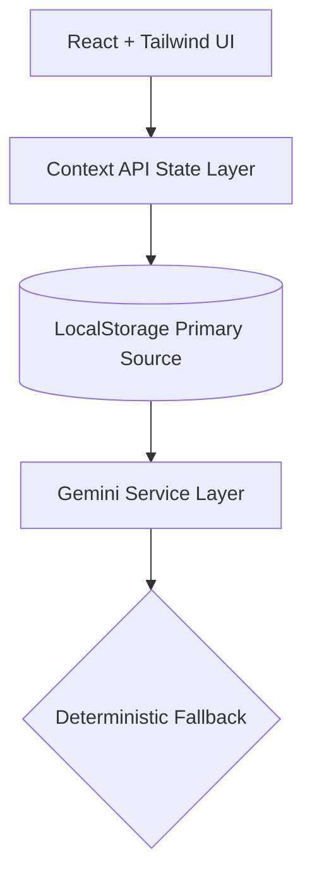

<div align="center">


### The App That _Becomes_ Your Business.

**Built for Paradox Hacks 2026 | Powered by Gemini ✦ | Designed to Win**

<br/>

[](https://reactjs.org/)
[](https://www.typescriptlang.org/)
[](https://tailwindcss.com/)
[](https://ai.google.dev/)
[](https://vitejs.dev/)

---

## 🏆 The Stakes: Paradox Hacks 2026

<table>
  <tr>
    <td align="center">💰 <strong>Prize Pool</strong></td>
    <td align="center">🎓 <strong>Masters' Union Degree</strong></td>
    <td align="center">🥇 <strong>1st Place</strong></td>
  </tr>
  <tr>
    <td align="center">Worth ₹5,00,000</td>
    <td align="center">Worth ₹22.65L</td>
    <td align="center">80% Scholarship</td>
  </tr>
</table>

> Dukaan.AI 2.0 is built to demonstrate what the future of Indian MSME digitization looks like. **This is not a demo app. This is a thesis on adaptive AI infrastructure for Bharat.**

</div>

---

## 🇮🇳 The Problem

India has **6+ crore small businesses**. Yet most operate:

- ❌ Without structured inventory
- ❌ Without analytics
- ❌ Without automation
- ❌ Without personalization
- ❌ Using generic tools built for the West

Existing POS systems assume:

> _"Every business is the same."_

They are not. A salon is not a grocery store. A pharmacy is not a restaurant. A bakery is not a kirana. **Yet software treats them identically.**

---

## ⚡ The Solution — Dukaan.AI 2.0

<div align="center">
  <h3><strong>Adaptive AI Business Operating System</strong></h3>
  <p>Same codebase. Different business identity.</p>
  <code>Onboarding Context ➔ AI Reshapes Experience ➔ UI Adapts Visibly</code>
</div>

Instead of saying _"Here is a grocery template, adapt to it,"_ we built a system that says:

> **"Tell us your business. The app adapts to you."**

---

## 🎯 Visible Adaptability (The Wow Moment)

### 🛒 Grocery

`Dashboard` | `Sales` | `Orders` | `Catalog` | `Settings`

### ✂️ Salon

`Dashboard` | `Sales` | **`Appointments`** | **`Services`** | `Settings`

### 🍔 Restaurant

`Dashboard` | `Sales` | `Orders` | **`Menu`** | `Settings`

### 💊 Chemist

`Dashboard` | `Sales` | `Orders` | **`Medicines`** | `Settings`

_AI-driven “Other” businesses dynamically resolve tab semantics. Same engine. Different UX. Instant business identity shift._

---

## 🚀 Core Capabilities

<details open>
<summary><b>1️⃣ AI-Powered Onboarding</b></summary>
<br>
Using <b>Gemini 2.5 Flash</b>, onboarding:
<ul>
  <li>Generates business-specific questions</li>
  <li>Extracts operational pain points</li>
  <li>Creates structured context</li>
  <li>Enables adaptive UI</li>
</ul>
<i>If AI fails → deterministic fallback ensures zero downtime.</i>
</details>

<details open>
<summary><b>2️⃣ Multi-Modal Data Ingestion</b></summary>
<br>
No manual-heavy setup required. Merchants can:
<ul>
  <li>📸 <b>Scan bills</b> (Gemini Vision OCR)</li>
  <li>💬 <b>Paste WhatsApp orders</b></li>
  <li>📊 <b>Upload CSV data</b></li>
  <li>📝 <b>Manual entry</b></li>
</ul>
<i>All normalized into structured JSON instantly.</i>
</details>

<details open>
<summary><b>3️⃣ Adaptive Navigation Layer</b></summary>
<br>
The bottom navigation dynamically changes based on business type, onboarding context, and AI interpretation. This creates instant, visible differentiation.
</details>

<details open>
<summary><b>4️⃣ AI Business Intelligence</b></summary>
<br>
Gemini continuously analyzes:
<ul>
  <li>Stock velocity & Low inventory</li>
  <li>Sales trends & Business seasonality</li>
</ul>
Generates contextual insights in real-time. <b>AI is advisory — never blocking.</b>
</details>

<details open>
<summary><b>5️⃣ Order Lifecycle Engine</b></summary>
<br>
Simulated B2C workflow:
<code>Order arrives ➔ Swipe to accept ➔ Stock deducts ➔ QR payment generated ➔ Order completed</code>
<br><br>
<i>All client-side. No server dependency. 100% Demo-safe.</i>
</details>

---

## 🏗 Architecture Philosophy



**Principle:**
_AI enhances. AI never blocks. Core commerce logic must survive without internet._

### 🔐 Hackathon Tradeoffs

For maximum velocity and demo-safety:

- API keys client-exposed
- No authentication enforced
- No backend server / webhooks

### 🗺️ Production Roadmap

- Move AI to serverless functions
- Secure keys & enforce Auth
- Add multi-device sync
- Introduce event-driven architecture

---

## 🛠 Tech Stack

| Layer           | Technology        |
| :-------------- | :---------------- |
| **Frontend**    | React 19 + Vite   |
| **Language**    | Strict TypeScript |
| **Styling**     | Tailwind CSS      |
| **State**       | Context API       |
| **Persistence** | localStorage      |
| **AI**          | Gemini 2.5 Flash  |
| **Hosting**     | GitHub Pages      |

---

<div align="center">

## 🧩 Why This Wins

**Business-first thinking** • **AI visibly integrated** • **Multi-industry applicability** • **Zero backend risk** • **High demo reliability** • **Clear startup scalability narrative**

<br>

> _"Judges should feel: This isn’t just a hack. This is a product direction."_

<br>

## 🚀 Run Locally

```bash
git clone https://github.com/dukan-ai/in.git
cd in
npm install

# Add your API key to .env
# VITE_GEMINI_API_KEY=your_key_here

npm run dev
```


### Built for Bharat. Built for MSMEs. Built to Win.

</div>
