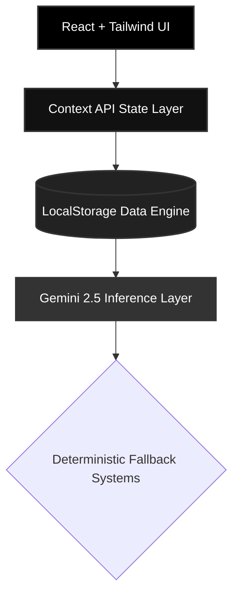

<div align="center">


### Software that molds to your business, not the other way around.

<br/>

[](https://reactjs.org/)
[](https://www.typescriptlang.org/)
[](https://tailwindcss.com/)
[](https://ai.google.dev/)
[](https://vitejs.dev/)

<br/>
<br/>

</div>

## �🇳 The 60 Million MSME Problem

India has over **6 crore small businesses**. Yet, when a local pharmacy or a neighborhood salon seeks digital infrastructure, they are handed the exact same generic point-of-sale software designed for supermarkets.

Existing software assumes:

> _"Every business operates the same way."_

They do not. A salon manages _appointments_, not orders. A restaurant manages a _menu_, not a catalog. **Software should understand this.**

---

## ⚡ The Solution: An Adaptive AI Business OS

**Dukaan.AI 2.0** is not just another commerce app. It is an **Adaptive Operating System**.
Using Google's Gemini 2.5 Flash, the app intelligently understands the merchant's business context during onboarding and **visibly rewires its own UI and workflows** to match their exact operational needs.

Same codebase. Zero new deployments. Endless business possibilities.

<br/>

<div align="center">
  
</div>

### 🎯 The "Wow" Factor: Visible UI Adaptation

The core engine remains exactly the same, but the user experience shifts instantly.

| Business Identity       | Adaptive Navigation Structure                                                |
| :---------------------- | :--------------------------------------------------------------------------- |
| 🛒 **Grocery / Kirana** | `Dashboard` \| `Sales` \| `Orders` \| `Catalog` \| `Settings`                |
| ✂️ **Salon & Spa**      | `Dashboard` \| `Sales` \| **`Appointments`** \| **`Services`** \| `Settings` |
| 🍔 **Restaurant**       | `Dashboard` \| `Sales` \| `Orders` \| **`Menu`** \| `Settings`               |
| 💊 **Pharmacy**         | `Dashboard` \| `Sales` \| `Orders` \| **`Medicines`** \| `Settings`          |
| 🤖 **AI-Determined**    | AI dynamically resolves semantics for any unlisted business type.            |

---

## 🚀 Core Capabilities

### 1️⃣ AI-Powered Strategic Onboarding

Using **Gemini 2.5 Flash**, the platform conducts a dynamic interview with the merchant:

- Generates business-specific questions on the fly.
- Extracts operational pain points and constraints.
- Employs deterministic fallbacks to guarantee 100% uptime, even if AI is unavailable.

### 2️⃣ Multi-Modal Data Ingestion

Removing the friction of manual data entry, merchants can upload their inventory via:

- 📸 **Vision OCR:** Snap a photo of a wholesale receipt.
- � **NLP Parsing:** Paste unstructured WhatsApp order messages.
- 📊 **CSV Bulk Import:** Standardized bulk data normalization.

### 3️⃣ Real-Time AI Business Intelligence

Gemini acts as an always-on, non-blocking advisor analyzing:

- Stock velocity and critical low-inventory items.
- Sales trends and seasonal shifts.
- Automated re-order message drafting for suppliers.

### 4️⃣ Serverless Order Simulation Engine

A fully contained, demo-safe B2C workflow:

- Real-time simulated order generation.
- Interactive swipe-to-accept pipeline.
- Instant stock deduction and AI QR payment generation.
- _Zero backend dependency._

---

## 🏗 Architecture & Technical Depth

Built for extreme resilience and maximal demo capability, Dukaan.AI 2.0 utilizes a pure client-side state architecture with zero reliance on traditional backend bottlenecks.



### 🛠 The Tech Stack

- **Frontend Core:** React 19 + Vite + Strict TypeScript
- **Styling:** Tailwind CSS (Minimalist, conversion-focused design)
- **State Management:** Context API (Decoupled & modular)
- **Local Persistence:** HTML5 `localStorage` Engine
- **Intelligence:** Google `gemini-2.5-flash`

---

<div align="center">

## 🌐 Run the Experience Locally

```bash
git clone https://github.com/dishudhalwal12/Breeze-26.git
cd Breeze-26
npm install

# Required: Add VITE_GEMINI_API_KEY to your env/Vite config
npm run dev
```

<br/>


<br/>

**Built for Bharat. Built for MSMEs. Built to scale.**

</div>
